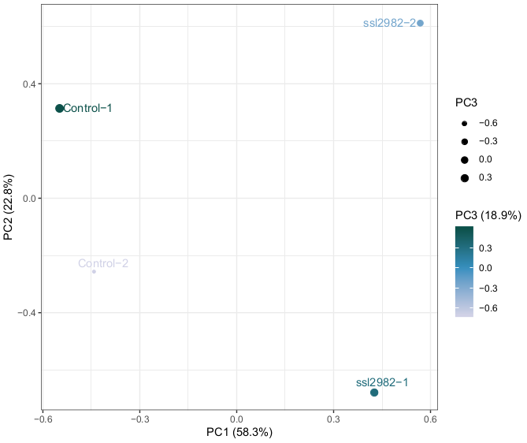

# ribopipe

RNA-Seq and Ribo-Seq (ribosome profiling) data workup pipelines


## About

`./rnapipe.sh rnapipe_config.sh` to run RNA-Seq pipeline using parameters defined in `rnapipe_config.sh`.

`./ribopipe.sh ribopipe_config.sh` to run Ribo-Seq pipeline using parameters defined in `ribopipe_config.sh`.

Analysis partially based on [Becker _et al._ (2013), DOI 10.1038/nprot.2013.133](https://www.nature.com/articles/nprot.2013.133).


## System requirements

Linux operating system (Tested on Ubuntu 18.04.3 LTS)

GNU parallel ≥ 20161222 (Tested with 20161222)

cutadapt ≥ 1.18 (Tested with 1.18 and 2.6)

sickle ≥ 1.33 (Tested with 1.33)

seqmagick ≥ 0.6.2 (Tested with 0.6.2 and 0.7.0)

bowtie 1.2.2 (Tested with 1.2.2)

Python 2.7 (Tested with 2.7.15+)

R ≥ 3.6.1 (Tested with 3.6.1)

R libraries: bioDist, data.table, doMC, dplyr, egg, factoextra, foreach, GenomicRanges, GGally, ggbio, ggplot2, ggrepel, optparse, outliers, parallel, plyr, pvclust, reshape, reshape2, scales, tibble

## Installation guide

```
git clone https://github.com/Asplund-Samuelsson/ribopipe.git
```

Installation of the pipeline takes approximately 20 seconds depending on connection speed.


## Demonstration

### Commands

In this demonstration, we will run the RNA-Seq pipeline on four example samples which are [real data](https://www.biorxiv.org/content/10.1101/823534v2.full) reduced to 200,000 reads each through random sampling:
```
examples/Control-1_1.fastq.gz
examples/Control-2_1.fastq.gz
examples/ssl2982-1_1.fastq.gz
examples/ssl2982-2_1.fastq.gz
```
Here ssl2982 is a _Synechocystis_ sp. PCC 6803 CRISPRi strain where the gene ssl2982 is knocked down.

Begin by creating the working directory and the raw input directory:
```
mkdir examples/RNAseq
mkdir examples/RNAseq/rawfastqgz
```

Copy the input files to the rawfastqgz directory:
```
cp examples/*fastq.gz examples/RNAseq/rawfastqgz/
```

A configuration file has been prepared with the required script paths, filtering and mapping software parameters, and paths to the necessary reference genome files. To run the pipeline, use the following command:
```
./rnapipe.sh examples/rnapipe_config_example.sh
```
The demonstration example takes 3 minutes and 30 seconds to run on a dual core 1.5 GHz system with 4 GB RAM.

### Expected output

The expected output consists of subdirectories with intermediate files, ultimately mapping the raw reads in the input to the _Synechocystis_ genome, including analytical results such as read counts for each gene and a PCA comparing the different samples. Final analysis results are stored in the `analysis` subdirectory:
```
examples/RNAseq/analysis/3D-PCA_clustering_of_samples.pdf
examples/RNAseq/analysis/all_CDS_RPKM_no_filter.tab
examples/RNAseq/analysis/all_genes_RPKM_no_filter.tab
```

Check the expression of ssl2982 in the different samples:
```
(
  head -1 examples/RNAseq/analysis/all_CDS_RPKM_no_filter.tab;
  grep -P "\tssl2982\t" examples/RNAseq/analysis/all_CDS_RPKM_no_filter.tab
) | cut -f 1,3,13 | column -tn -s $'\t'
```

ssl2982 should be strongly repressed in the CRISPRi samples marked `ssl2982`:
```
Sample     Name     RPKM
Control-1  ssl2982  234.30819042646
Control-2  ssl2982  329.996457170599
ssl2982-1  ssl2982  22.1677687685837
ssl2982-2  ssl2982  0
```

The PCA clustering analysis should look like this:


### Further instructions

To generate the RNA-Seq results for ["Pooled CRISPRi screening of the cyanobacterium _Synechocystis_ sp. PCC 6803 for enhanced growth, tolerance, and chemical production"](https://www.biorxiv.org/content/10.1101/823534v2.full), download RNA-Seq data from https://www.ebi.ac.uk/ena/data/view/PRJEB35238 and place the files in a folder named `examples/CRISPRi_library_RNAseq/rawfastqgz`. Then run the pipeline:
```
./rnapipe.sh edited_configs/rnapipe_config_CRISPRi_library_RNAseq.sh
```
Note that this is configured for 16 parallel processes (10 cores in the bowtie mapping steps). You might need to adapt this to fit the number of processor cores and RAM of your computer. The original data analysis was carried out on a system with 16 cores and 128 GB RAM. Furthermore, the working directory, including intermediate files, is expected to take up >190 GB of disk space.


## Authors

Jan Karlsen, KTH (jan.karlsen@scilifelab.se)

Johannes Asplund-Samuelsson, KTH (johannes.asplund.samuelsson@scilifelab.se)
